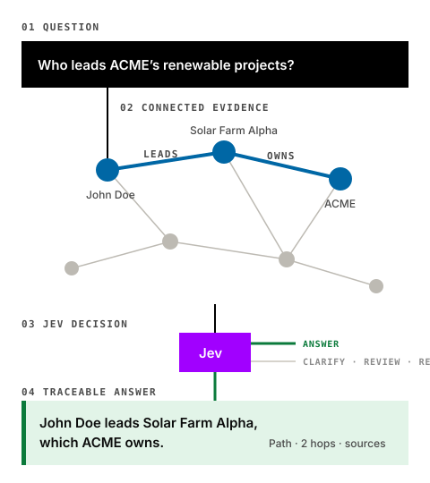

<div align="center">

# Graphs + Jev

### Turn connected evidence into bounded decisions.

[**Open the interactive field guide →**](https://graphs-and-jev-956922431929.australia-southeast1.run.app/)



</div>

Graphs preserve the relationships between facts. Jev decides, from that evidence, whether an agent may answer, must ask, must refuse, or must hand the question to a person.

## Explore the publication

- [How graphs and Jev work together](https://graphs-and-jev-956922431929.australia-southeast1.run.app/#how-it-works)
- [DCCEEW catalogue discovery](https://graphs-and-jev-956922431929.australia-southeast1.run.app/dcceew/)
- [Parkinson’s research evidence](https://graphs-and-jev-956922431929.australia-southeast1.run.app/parkinsons/)
- [Little Bunnies: why two hops are usually enough](https://graphs-and-jev-956922431929.australia-southeast1.run.app/little-bunnies/)
- [Graph-engine guide and browser labs](https://graphs-and-jev-956922431929.australia-southeast1.run.app/#technical-guide)

The publication is served by the current Rust application from one Cloud Run origin. The field guide calls the same-origin catalogue and decision APIs; Parkinson’s research questions use bounded live public-page retrieval. No browser credentials, API tokens, analytics, or cookies are required.

## About

This is a personal open-source research and demonstration project by TLatAccenture. It is not an official Accenture or Google Cloud product. Product names and marks belong to their respective owners.

## Run locally

Run the current Rust application from the repository root:

```bash
cargo run
```

Open <http://localhost:8080/>. The service reads `catalogue.json` and serves `static/` by default. Set `PORT`, `CATALOGUE_PATH`, or `STATIC_DIR` only when you need different paths or a different port. Readiness and liveness endpoints are available at `/api/ready` and `/api/health`.

### Run the Rust container

Build the same Linux architecture used by Cloud Run, then smoke-test it on a random local port:

```bash
docker build --platform linux/amd64 -t graphs-and-jev:test .
./scripts/smoke-container.sh
```

To run it directly:

```bash
docker run --rm -p 8080:8080 -e PORT=8080 graphs-and-jev:test
```

Open <http://localhost:8080/>. The scratch image runs as non-root UID 65532 and contains only the static service binary, catalogue, and field-guide assets. The smoke script verifies the static x86-64 ELF, exact scratch rootfs allowlist, image UID, and every API route, including a non-clinical live LRRK2 research request. `CATALOGUE_PATH` and `STATIC_DIR` default to the packaged catalogue and field guide; override them only when mounting replacements. Cloud Run should configure external startup and liveness probes for `/api/ready` and `/api/health`; the image deliberately contains no HTTP client, cloud SDK, or credentials.

## Reuse

No reuse licence is granted yet. All rights are reserved unless a licence is added later.
